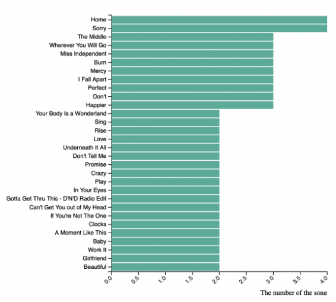
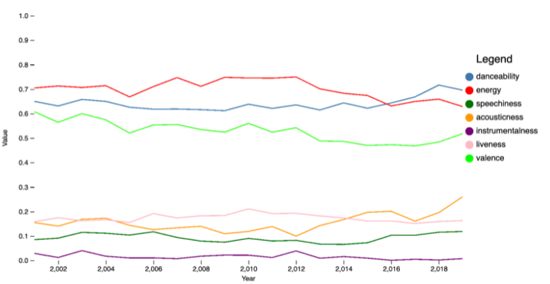

# 05499 Final Project

## Proejct Title
**Popular Songs on Spotify from Year 2001 to Year 2019**

## Team Members
Emily Zhang, Anthony Wu, Yiluo Qin, Yu-Jan Chang

## Abstract
As music lovers, we cannot live without good and fresh music. One of the main motivations for our final project is to explore and demonstrate how music has changed and shaped our lives throughout the years. In order to get access to some of the most representative music statistics, we chose to look at one of the many Spotify datasets on Kaggle **Spotify Top 100 Tracks (2001-2019)**. In our project, we aim to use different visualization techniques including horizontal bar chart, multiline chart, word cloud, stacked bar chart, and line chart to understand how music has changed over the past years. We aim to visualize from different perspectives how Spotify has provided us an insight of how music itself and our taste of music collectively have envolved from years 2001 to 2019. 

## Summary Images
#### A horitontal bar chart showing the top 35 songs over the years.

#### A multiline chart showing the trends of various quantitative characteristics of songs over the years.

#### A word cloud in 2003 showing the most occured words in song names.

#### A stacked bar chart showing how male and female artists distribute over the years.

#### A line chart showing how an artist performs over the years.

## Link to paper
[link to the paper](https://www.example.com/my%20great%20page)

## Video
[link to the video](https://www.example.com/my%20great%20page)

## Link to Webpage
[link to the webpage](https://www.example.com/my%20great%20page)

## Work Breakdown
- Emily:
1. Collaborated on the initial project proposal design video.
2. Worked on the multi-line chart and the word cloud.
3. Assembled all pieces of code together and mainly worked on the project application.
4. Collaborated on the final project presentation video.
- Anothy:
1. Collaborated on the initial project proposal design video.
2. Worked on the horizontal bar chart.
3. Assisted the write up and proofread the readme file.
4. Collaborated on the final project presentation video.
- Yiluo:
1. Collaborated on the initial project proposal design video.
2. Worked on the stacked bar chart.
3. Mainly drafted the write up and wrote the readme file.
4. Collaborated on the final project presentation video.
- Yu-Jan:
1. Collaborated on the initial project proposal design video.
2. Worked on the line chart.
3. Assisted the write up and proofread the readme file.
4. Collaborated on the final project presentation video.

## Project Process
1. On November 10th we set up a Zoom meeting to discuss and to brainstorm for the final project ideas. We initially wanted to a greenhouse gas analysis; however, based on the TA's feedback, we realized the topic was too broad. Then, we listed a few other new topics including housing prices in Pittsburgh and popular songs on Spotify. In the end, we decided to stick with the Spotify idea because all four of us are familiar with the topic. 
2. From November 11th to 24th, each one of us was assigned with a separate section of the project. We did our own research on the Internet to make sure our visualizations were functional. Some of us performed data preprocssing and data transformation before data visualization, which is addressed in detail in the final writeup. 
3. On November 25th, we set up another Zoom meeting to exchange the progress and discuss what needed to be done and fixed. 
4. On November 28th and 29th, we met on Zoom to merge our individual parts of the project and to finalize our writeup.
5. On November 30th, we altogether met on Zoom and recorded the video presentation of the final project.