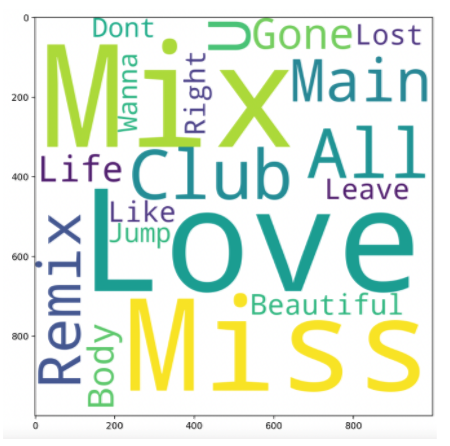

# 05499 Final Project

## Proejct Title
**Popular Songs on Spotify from Year 2001 to Year 2019**

## Team Members
Emily Zhang, Anthony Wu, Yiluo Qin, Yu-Jan Chang

## Introduction
As music lovers, we cannot live without good and fresh music. One of the main motivations for our final project is to explore and demonstrate how music has changed and shaped our lives throughout the years. In order to get access to some of the most representative music statistics, we chose to look at one of the many Spotify datasets on Kaggle, which is currently the largest online platform for the data science community with powerful tools and resources to help people achieve data science goals. Among the many music dataset providers, we decide to look at Spotify’s because according to Wikipedia, it is the “world's largest music streaming service provider, with over 381 million monthly active users, including 172 million paying subscribers, as of September 2021”. In our project, we aim to use different visualization techniques including bar chart, multiline chart, word cloud, stacked bar chart, and line chart to understand how music has changed over the past years. In the end of the project, we have also provided users with a prediction model allowing for song recommendations.

## Detailed Goals of the Project
- Examining examples of successful songs
    - Which songs remained in the top 100 for the most number of years
- Examining artists gender distribution of successful songs
    - Proportions of male vs female artists in the top 100 songs over the years
- Recognizing characteristics of popular songs
    - Danceability, Energy, Speechiness
    - Common topics in popular songs
- Identifying trends in popular songs over time
    - Large aggregate graphs, exploratory linear analysis

## Dataset Overview
Our dataset directly comes from [Kaggle](https://www.kaggle.com/delaneyisabella/spotify-top-100-tracks-20012019?select=Top2019.csv), and it consists of 19 separate csv files. (maybe a dataset link should be provided) Each file lists the top 100 most played songs on Spotify throughout the year from 2001 to 2019, and all 19 files have exactly the same columns. Each file consists of the 17 distinct columns including the name of the song, the artist of the song, and different quantitative statistics of the song including energy and speechiness. One snapshot of the dataset is provided below to better understand how the data looks like.

## Related Work
A source of inspiration for our project is the [Spotify Wrapped](https://www.spotify.com/us/wrapped/) produced at the end of each year for Spotify users, outlining statistics like top artists, minutes listened, and other listening patterns from that year. This dataset we found has similar information on listening trends, but at a higher level. As a result, our final project goal was to present a similar narrative using data visualizations to depict listening trends over the years that users can personally compare their own listening habits to. 

## Methods

#### Data Preprocess
1. For the purpose of more convenient data analysis, we concatenated all 19 files into one file on the *"Year"* column. 
2. One additional *"Gender"* column is manually generated to assist the construction of the stacked bar chart in our project. The *"Gender"* column consists of three distinct values: *"F"* denoting individual female artists or bands with all female members, *"M"* denoting individual male artists or bands with all male artists, and *"X"* denoting bands with both female and male artists.  
3. For the multiline chart based on variables (danceability, energy, etc.), a new csv mapping year to the average of each variable for that year was created. 
4. To count the number of top songs each singer has per year for the multiline chart, SQL is used to group the artists and year. Finally, an aggregated *"Count"* column is added to the CSV file.

#### Data Visualizations
We have included five main data visualizations: bar chart, multiline chart, word cloud, stacked bar chart, and line chart. Each of the components will be discussed further in the **Results** section.

## Results

#### Horizontal Bar Chart

The horizontal bar chart visualizes the number of years a particular song has been ranked within the annual top 100 songs within the years 2001 to 2019. Looking at the chart, we can see that the maximum number of years that any song has been ranked within the top 100 is four times. Of the 1900 songs listed within our dataset, 99 songs have ranked within the top 100 songs twice during this 20 year period. We can see that trends can quickly go out of mode and songs will quickly lose popularity.

#### Multiline Chart

This multiline chart was created to show how factors used to quantitatively describe a song (danceability, energy, speechiness, acousticness, instrumentalness, liveness, valence) may have changed over the years. We can see from the graph that each variable remained relatively unchanged (confirming that the formula for a successful top-100 song is pretty static). However, there is a slight trend toward less energetic & more acoustic songs amidst the mild fluctuations. 

#### Word Cloud in 2003

#### Word Cloud in 2018

This set of visualizations shows the (up to) top 20 most frequent words found in song titles for each year. There was some minor data cleaning to remove punctuation and meaningless words (mainly pronouns and prepositions). We can see from the various visualizations that love, like, and girl are common themes throughout. In the later years, some artists are so prominently featured that their names pop up in the wordclouds as well.

#### Stacked Bar Chart

Now we look at the stacked bar chart which chronicles the gender distribution of the top 100 songs from the year 2001 to the year 2019. We clearly see that male artists are significantly more dominant than female artists in all of the years. Specifically, male artists consist of around 60% of the whole proportion every year. We can also visualize that mixed artist bands don’t have too much attraction in any of the years, with the largest number 8 occurring in 2008. We speculate that male artists are more dominant in the music industry; therefore, there is a higher chance of having a male artist showing up on the top 100 most popular songs list.

#### Line Chart

The line chart was created to help readers evaluate different singers’ performances chronologically. In this chart, readers will be able to select a singer in the drop-down menu, and through navigating this chart, readers might notice that since 2004, Maroon 5 has been on the Billboard chart every year, indicating their popularity all around the world. After 2005, Coldplay always kept their songs in the top 100 till 2016. In this chart, readers can observe different singers’ popularity and productivity for the past 19 years.

## Disuccsion
In our exploration, we identified trends in popular songs over time, some examples of successful songs, the gender distribution of artists in top 100 songs from 2001 to 2019, and recognized characteristics of popular songs, such as danceability, energy, and speechiness.

What we have found is that songs can quickly fall out of the current trend; with our horizontal bar chart analyzing how successful a particular song was by counting the number of years a song had ranked within the top 100 for any given year, we found that the maximum number of years was four.

And looking at the multiline chart, we can see the ephemeral characteristic of a particular song reflected in artist performance throughout the years. What we took note of was that popular artists such as Maroon 5 or Coldplay maintained their status of top 100 Billboard song creators by consistently producing songs that made it into the list. To account for how quickly a song may fall out of popularity, artists consistently output songs each year to compensate for this effect.

Going further into the analysis of songs, we looked at the lyrics that make up the songs and how they may correlate with their popularity. In our data visualizations, we found that the teh major semantic meanings seem to be unchanged while small words like Khalid or Cardi could pop off year by year.

Finally, with the stacked bar chart that visualizes the gender distribution of top 100 artists during the 20 year time period. What was found was that the music industry is dominated by males; approximately 60% of artists of each year were males. This means that there is a high chance that future top 100 artists will be male.

With these observations and an understanding of how music changes throughout the years, we speculate an artist that will most likely be successful is an artist that is able to output a consistent volume of songs each year, use particular lyrics in their songs, and be male. In recognizing successful characteristics of songs, we were also able to develop a model that gives suggestions on what songs will most likely meet your musical preferences.

## Future Work
Though our team has addressed some accessibility issues by making sure the font size is readable, adding alt text to each div, and the color contrast passed the World Wide Web Consortium(W3C) standard 4.5:1, we believe there is more to work on in the future. To make our charts more accessible to people with visual impairments, we plan to add different textures, such as strips or dots, to the stacked bar chart and horizontal bar chart so that color blind people will be able to distinguish the categories easily. Though we have tested our data visualizations with VoiceOver and there are no major accessibility issues identified, we hope to reach out to specific screen reader users because they might be able to identify issues we ignored or have not yet discovered. Finally, our team believes it would be ideal to include a data table in each of our data visualizations in the future because from the previous class, we learned that a data table sometimes could better represent the data structure than simply describing the chart distribution for blind people.  

Another aspect we can look into is to build a machine learning model on top of the dataset we have. More specifically, in the future, people could use the same dataset and implement a recommendation algorithm to recommend users with songs based on their personal preferences. For example, the algorithm can take users’ favorite artists, preferable songs’ statistics including danceability or loudness, and other aspects of the dataset into consideration and output a list of 10 songs from the most relevant to the least back to the users. Such an algorithm will be considered as a supervised machine problem. One approach could be implementing a K-nearest neighbors (KNN) classifier where each song will become a vector with 15 features from the original dataset (excluding the name of the song and the ID of the song). Once users have selected a targeted song/artist, the KNN will look for that specific data point and look for the k-nearest neighbors among all 15 dimensions and return the k most relevant songs to the users. Another approach could be constructing a Logistic Regression model which outputs a list of 10 songs with indicated probabilities if the user should listen to the recommended songs. Ultimately, these are just a couple of easy-to-understand machine learning models, and certainly many other kinds of machine learning algorithms could also be constructed and put into practical usage.
